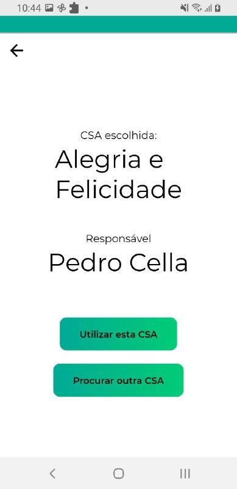
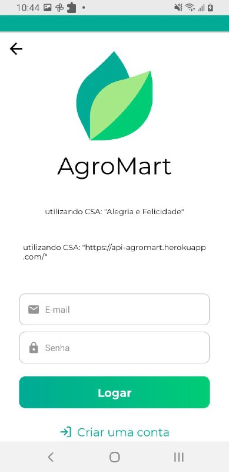
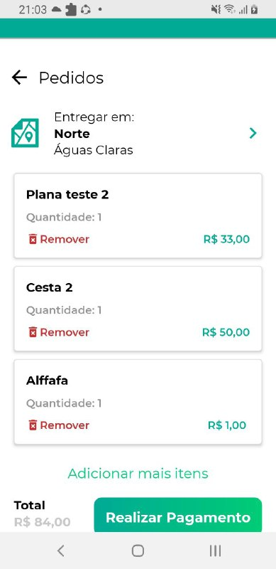
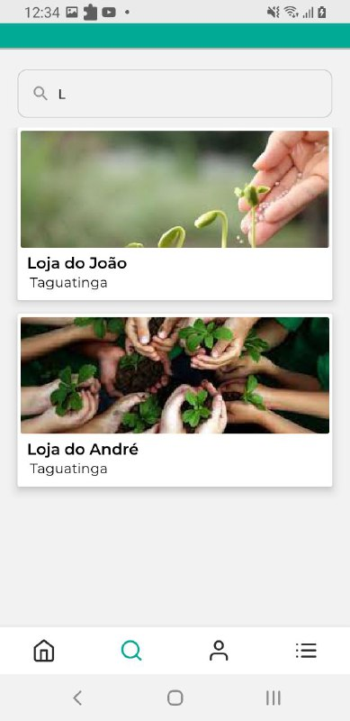
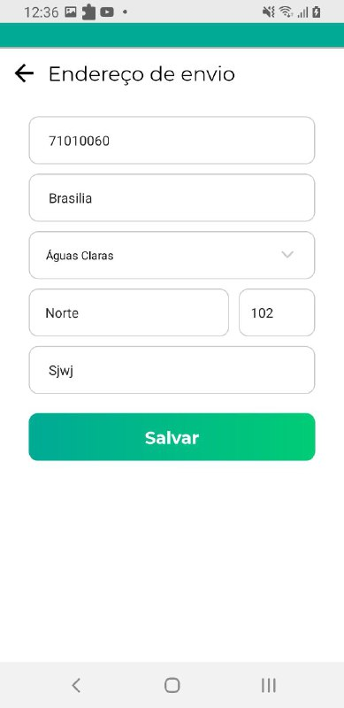
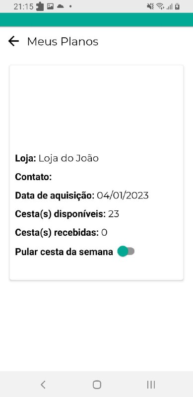
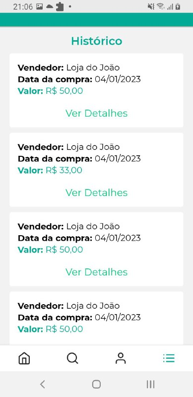
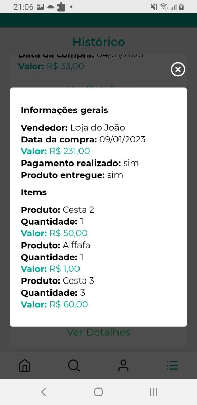

# Validação
 
## Prototipação
 
### Metodologia
Consiste em criar um protótipo para que a equipe de desenvolvedores tenha uma noção do que será apresentado no aplicativo final.

 
 
 
 
 
## Validação informal
 
### Metodologia
Consiste em que a documentação seja avaliada pelo Stakeholder, para que o mesmo informe a equipe se o projeto está sendo documentado da forma correta para o seu processo de desenvolvimento.
 

Esse foi o feedback que obtivemos a partir da avaliação do projeto pelo Scrum Master do Mia Ajuda.
 
---