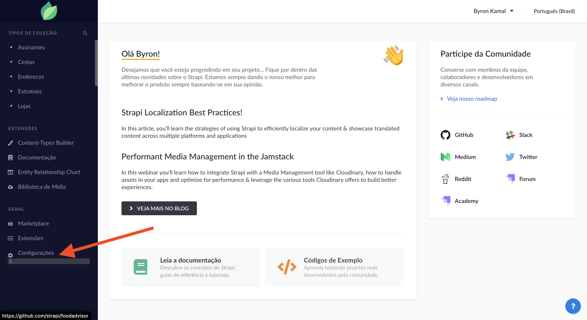
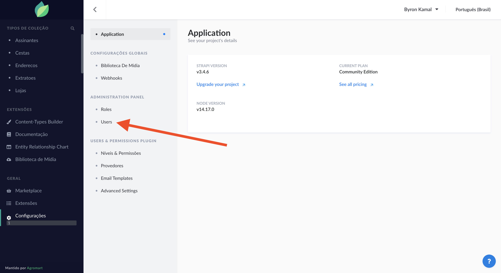
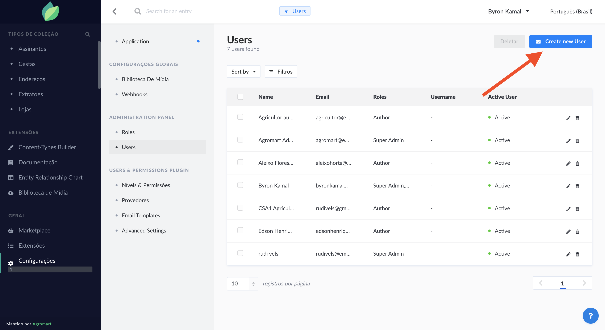
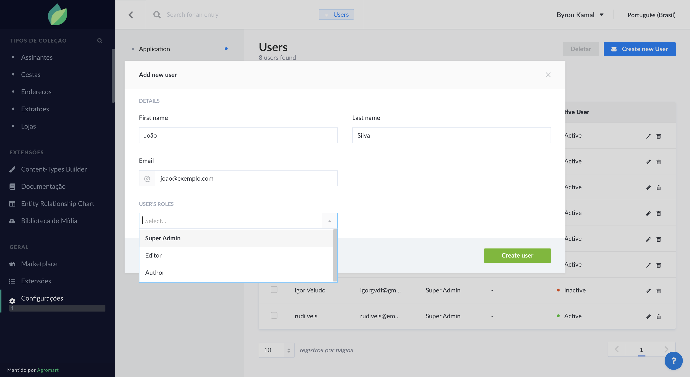
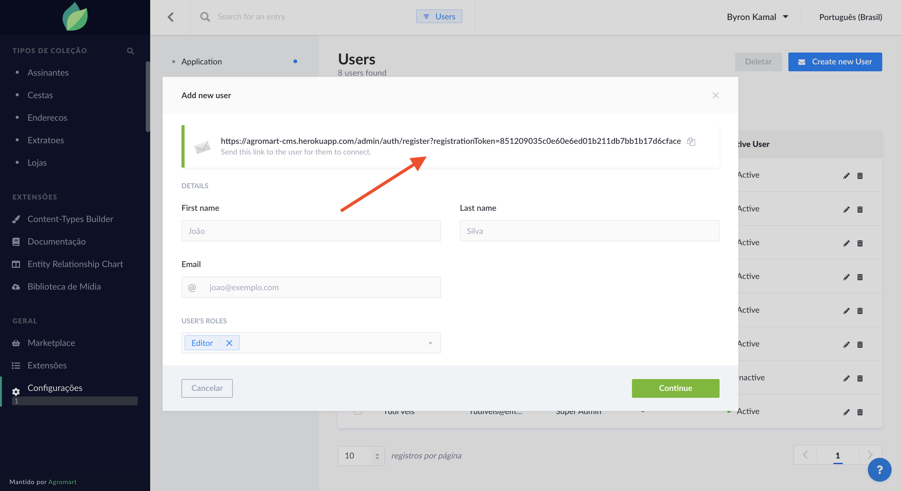
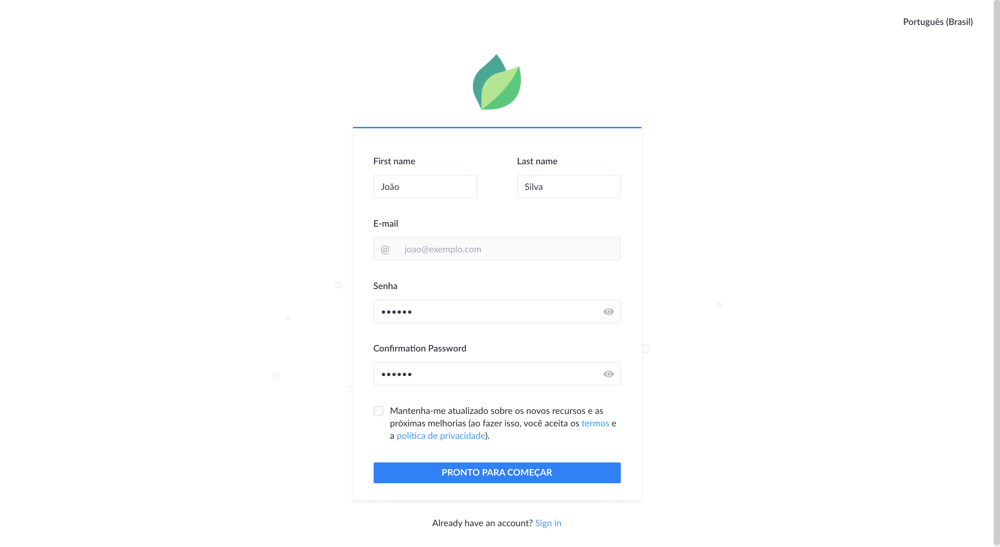

#### Passo 1 - Após fazer o login no CMS, clique na opção "Configurações", no menu lateral.

#### Passo 2 - Clique me "Users", localizado no "Administration Panel".

#### Passo 3 - Clique no botão "Create new User"

#### Passo 4 - Insira as informações do novo usuário e depois escolha o tipo de perfil. Depois clique em "Create user".

##### Passo 5 -  É gerado um link de cadastro, copie-a e passe para o usuário, assim ele terminará o cadastro.

#### Passo 6 - O novo usuário deve acessar o link que lhe foi passado e concluir seu cadastro. Após isso, já é possível acessar a plataforma.
