# BPMN

O BPMN ou Business Process Model and Notation é uma notação muito conhecida no mercado com o foco na especificação de processos de desenvolvimento, ela possui uma grande riqueza na representação de detalhes advindos do desenvolvimento de software.

## BPMN

# Administrador

## Assinantes

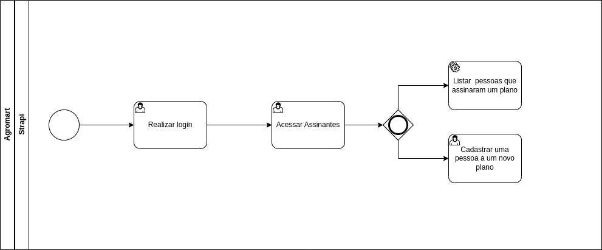 

## Cestas

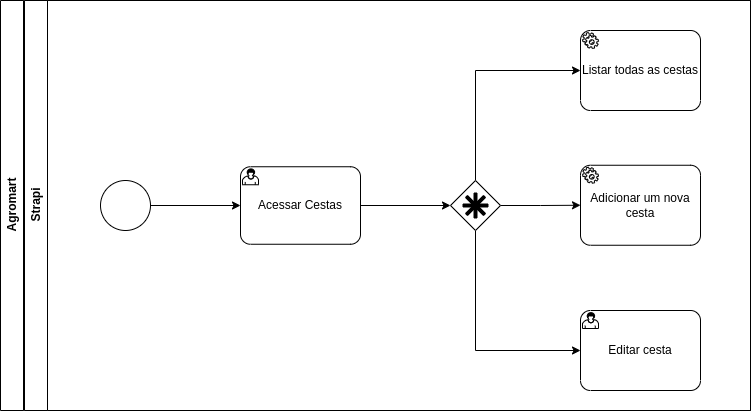

## Endereços

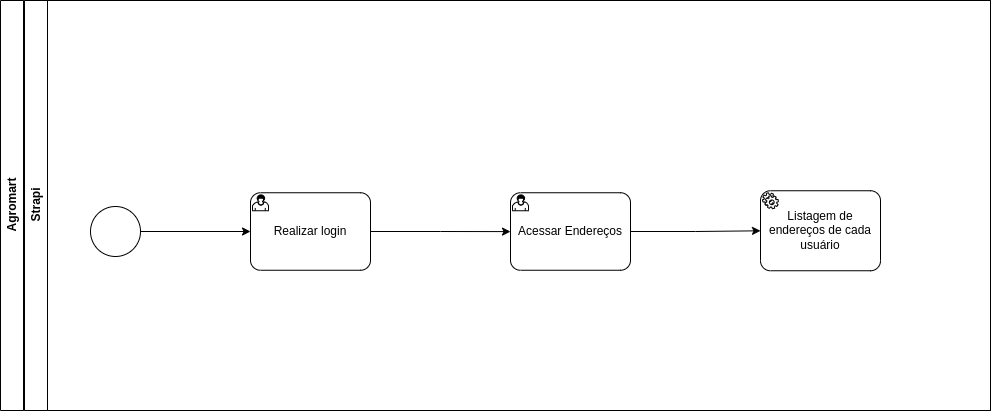

## Extratos

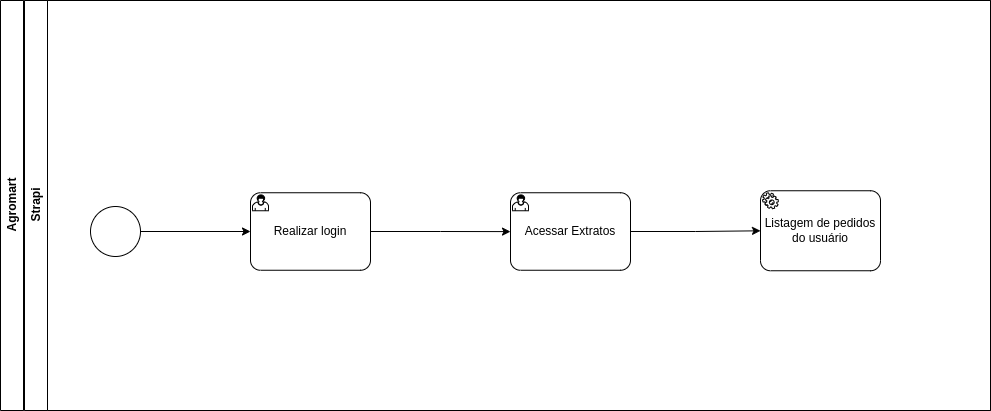

## Planos

## Produtos

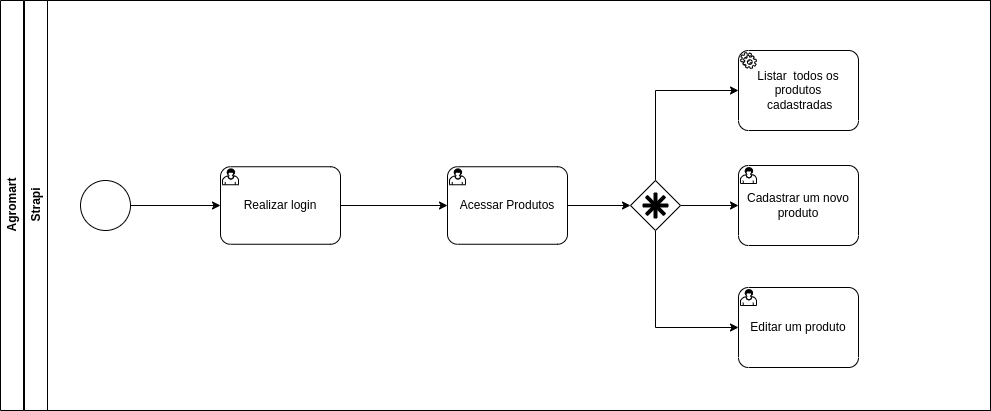

## Lojas

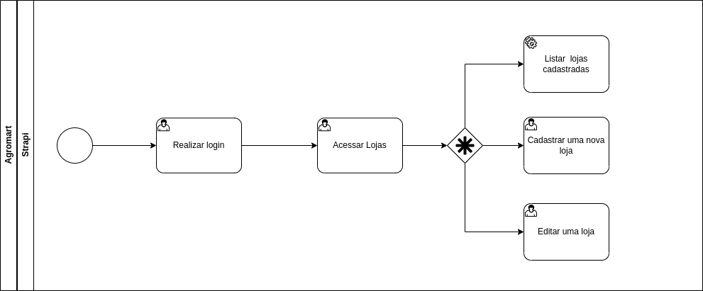

# Co-agricultor

## Login

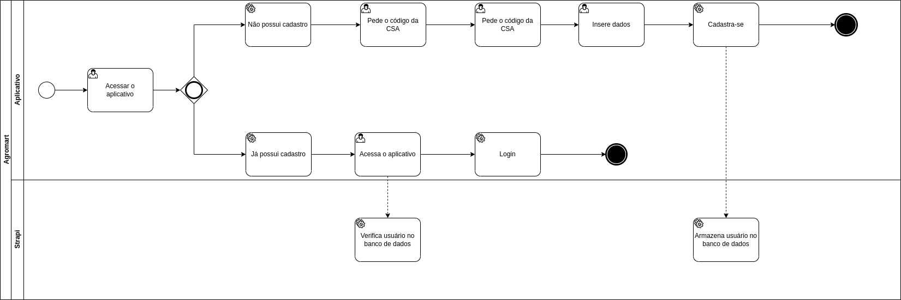

## Meus Endereços

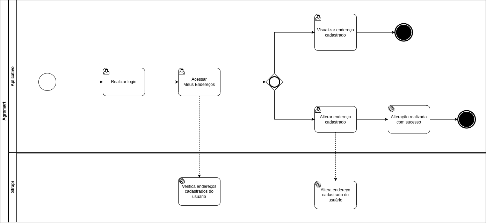

## Meus Planos

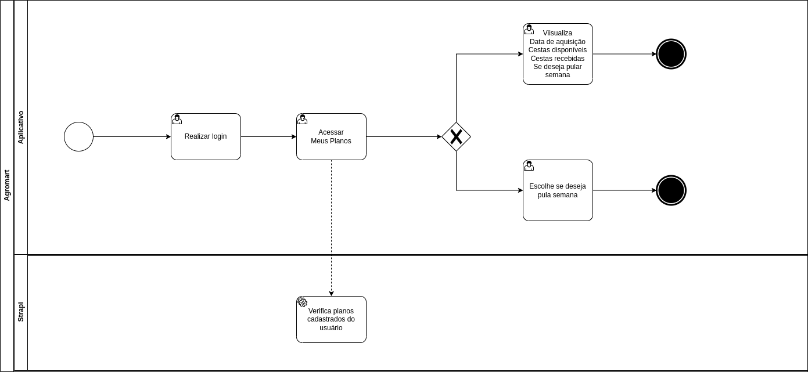

## Adicionar ao Carrinho

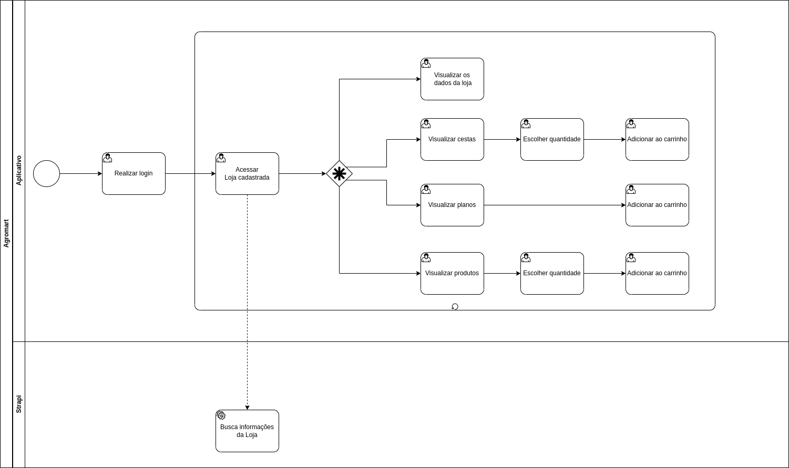

## Finalizar Compra

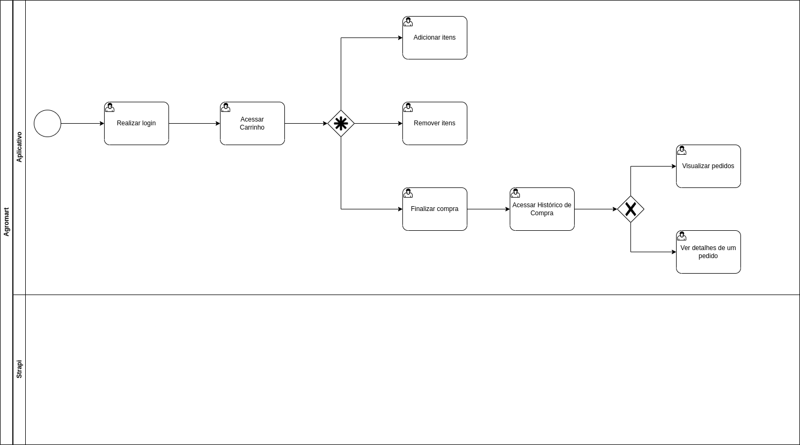