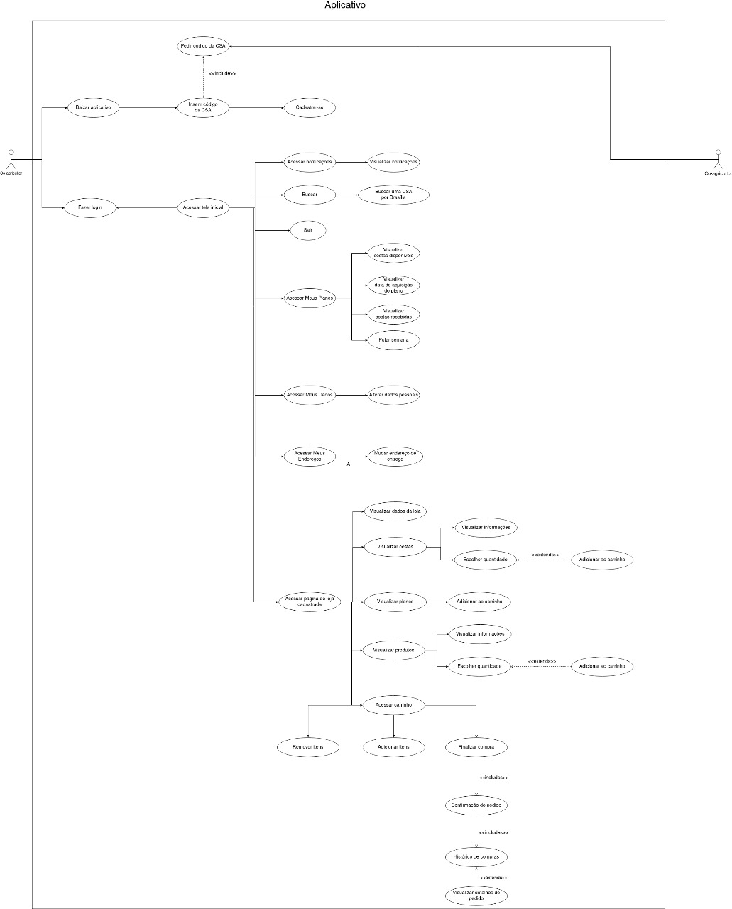
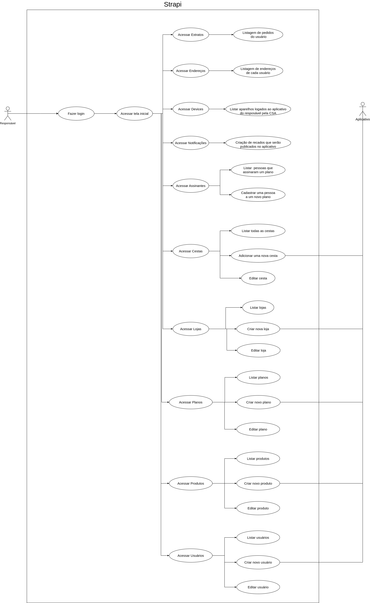

# Caso de Uso

O caso de uso é forma de modelagem que serve para ilustrar a ideia ou do software ou dos requisitos levantados, é uma ferramenta muito útil para podermos analisarmos de forma ilustrativa a ideia e o funcionamento do software, dessa forma fica mais claro como ele funciona, bem como possíveis erros que ele poderá ter. Essa ferramenta também é muito útil para se explicar à um cliente ou uma pessoa que não esteja envolvida na área de Tecnologia da Informação, o que torna esse método imprescindível para a parte de modelagem é o que foi supracitado antes que é a forma de se ilustrar ou criar um modelo físico do conceito e das ideias criadas do software.

# Diagramas de Casos de Uso

## UC01 - Aplicativo Agromart

|Sigla|Descrição|
|:-:|:-|
|Autor|Pedro Vítor de Salles Cella|
|Descrição|Uso das funcionalidades do Aplicativo|
|Ator|Co-agricultor|
|Pré-condições|O usuário ter o código da CSA e consequentemente estar cadastrado no sistema|
|Fluxo Principal|<ul> <li>- Acessa através do *log in* na conta</li> <li>- Acessa página da loja</li><li>- Adiciona um plano, ou produtos ou uma cesta ao carrinho</li><li>- Realiza a compra</li></ul> |
|Fluxo Alternativo|<ul> <li>- Acessa o Strapi</li> <li>- Verifica e adiciona Cesta ao carrinho</li> <li>- Finaliza compra</li><li>- Verifica o Histórico de Pedidos</li> <li>- Verifica detalhes do pedido</li> </ul> |
|Fluxo de Exceções|- O Usuário deve criar uma conta utilizando o código da CSA |
|Pós Condições|Facilitação da compra de cestas, planos e produtos|

## UC02 - Strapi

|Sigla|Descrição|
|:-:|:-|
|Autor|Pedro Vítor de Salles Cella|
|Descrição|Utilização das funcionalidades do Strapi|
|Ator|Administrador da CSA|
|Pré-condições|O Administrador já deve ter criado a CSA localmente e já deve ter o deploy da aplicação|
|Fluxo Principal|<ul><li>- Acesso através do *log in* na conta</li><li>- Visualiza a página de cestas</li><li>- Verifica se o usuário irá pular a semana</li></ul>|
|Fluxo Alternativo|<ul><li>- Acesso através do *log in* na conta</li><li>- O Administrador acessa a página de assinantes</li><li>- Adiciona um co-agricultor a um plano de assinatura</li></ul>|
|Fluxo de Exceções|O co-agricultor não realizou o pagamento|
|Pós Condições|O Administrador pode ver o co-agricultor na tabela de assinantes|