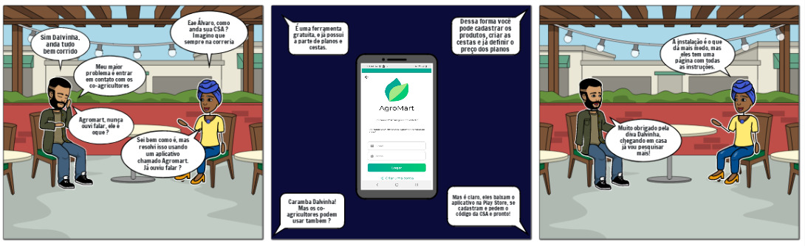
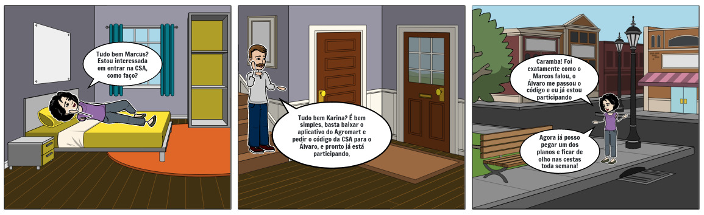
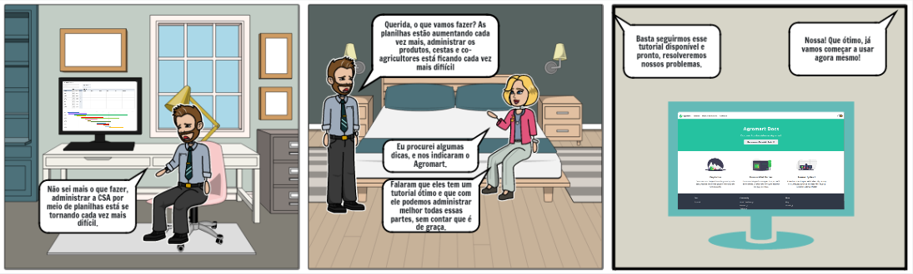

# Storytelling

Storytelling é uma técnica de criação de narrativas, que também, pode ser utilizada para que o engenheiro de software identifique o público alvo de seu projeto, qual é o problema que deve ser resolvido e como ele pode ser resolvido. Dessa forma pode ser elicitar os requisitos do software. Associado ao uso de Personas e Storyboards.

## Histórias

|Persona|Dados|
|:-:|:-:|
|Nome|Álvaro|
|Idade|43|
|Profissão|Dono de CSA|
|Formação|Hisoria|

### História de Álvaro

Álvaro tem 43 anos é formado em História pela Universidade da Bahia, nascido em Salvador, veio para Brasília aos 27 anos, porém mudou seu estilo de vida quando comprou uma xácara em Planaltina. Descobriu sobre as CSAs e resolveu criar sua própria, desde então vem matendo sua CSA por meio de anotações e grupos no Whatsapp, mas principalmente ele mantinha salvo tudo em suas anotações pessoais no celular. Um dia infelizmente seu celular quebrou e isso acarretou em não conseguir atualizar as controlar a chegada dos novos co-agricultores, os produtos que estariam na cesta da semana, os planos de cada co-agricultor, além disso ocorreu também a pandemia, então ficou ainda mais difícil se organizar.

Álvaro acabou perdendo muitos co-agricultores por conta dessa desorganização, sem contar que além de manter essa parte ele deveria se informar também dos produtos, disponibilizados pelos agricultores, que estariam disponíveis na cesta da semana.

Álvaro conseguiu passar pela pandemia, porém isso afetou muito sua qualidade de vida, logo ele por acaso entrou em contato com uma amiga que também participava de uma CSA, chamada Dalva, ela lhe informou sobre o aplicativo do Agromart, falando como funcionava e também quais eram seus pontos positivos e suas possíveis dificuldades.

---

|Persona|Dados|
|:-:|:-:|
|Nome|Karina|
|Idade|27|
|Profissão|Estudante de Direito|
|Formação|Graduação Incompleta|

### História de Karina

Karina é uma estudante de 27 anos, está cursando a graduação de Direito na Universidade de Brasília, nascida e crescida em Brasília, Karina percebeu que seus hábitos alimentares não eram bons, e decidiu mudar comprando mais frutas, legumes e vegetais, porém durante suas compras no supermercado, ficou assustada com o preço, mas além disso ficou surpresa com o tamanho desses produtos, por ter família no interior de Minas Gerais, ela sabe que as frutas e verduras não tem um tamanho tão grande quando cultivadas naturalmente. Por conta disso Karina resolveu buscar novas formas de conseguir alimentos mais saudáveis e sem o uso exarcerbado de agrotóxicos.

Karina buscando soluções, acabou encontrando as chamadas CSA, ela ficou preocupada, pois já estava imaginando o processo demorado que deve ser para se filiar a uma CSA, pesquisando ela encontrou a CSA do Álvaro, ela se interessou pois poderia buscar os produtos perto de casa, sem contar que as fotos eram bem chamativas, com várias verduras e frutas que pareciam ótimas. Karina resolveu entrar em contato com Marcus, Marcus é o seu tio que mora próximo e que já participa da CSA, querendo participar da CSA, Marcus atendeu o telefone e a instruiu a baixar o aplicativo do Agromart, ele disse que é só baixar e pedir o código para o responsável que é o Álvaro. Na tarde daquele mesmo dia Karina baixou e com o contato do Álvaro fornecido pelo seu tio, se apresentou e pediu o código para Álvaro, depois de pouco mais de 15 minutos Karina já estava participando da CSA.

---

|Persona|Dados|
|:-:|:-:|
|Nome|Marcelo|
|Idade|46|
|Profissão|Engenheiro Eletricista|
|Formação|Engenharia Elétrica|

### História de Marcelo

Marcelo é formado em engenharia elétrica pela Universidade do Rio Grande do Sul, e casado com sua esposa Mariana há 20 anos, enquanto Marcelo trabalha como engenheiro elétrico, Mariana administra uma CSA, ambos tem uma chácara em Samambaia, e lá ela administra sua produção assim como a de outros agricultores parceiros, porém ela não tem um grande conhecimento em tecnologia, por isso sempre pede uma ajudinha para o seu marido Marcelo, dessa forma eles administram tudo através de tabela e planilhas, anotando o nome dos co-agricultores, seus planos e os produtos que deverão estar na cesta da semana. Marcelo porém está ficando cada vez mais cansado, afinal ele trabalha e em seu tempo livre ajuda na CSA.

Mariana em busca de uma solução acaba sendo sugerida por um co-agricultor que também participa de outra CSA, ele disse que na outra CSA eles implementaram o aplicativo do Agromart, nele é capaz de gerenciar os co-agricultores que entram, os produtos, as cestas e até mesmo os planos. Ele disse também que existe um tutorial no site que ajuda eles a instalar e a usar, e que o melhor disso tudo é que é totalmente gratuito.

Mariana conta ao seu marido e ambos correm para a página para já começar a implantar essa nova tecnologia.

